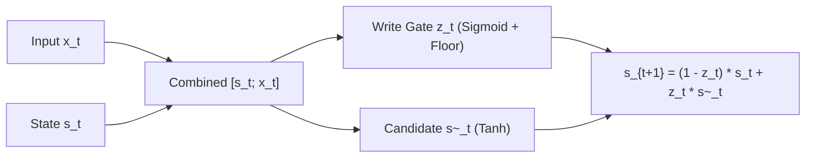
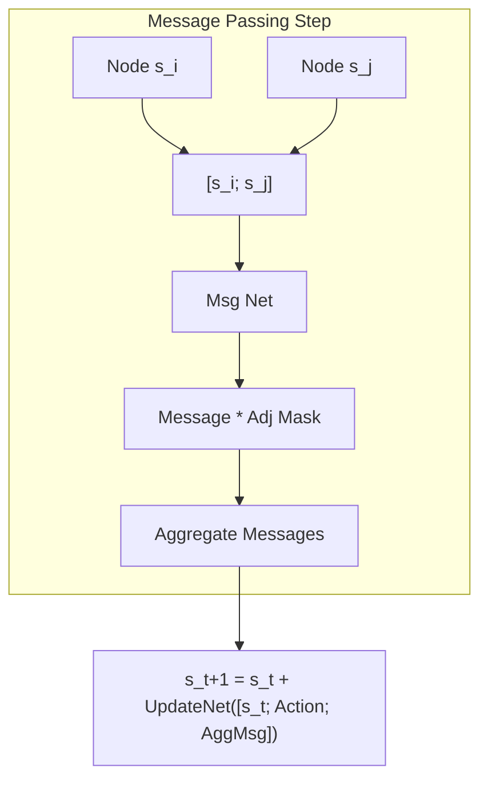

# Persistent-Sparse-Semantic-Architecture (PSSA) Technical Specification

This document provides a mathematically rigorous, component-level specification of the **Persistent-Sparse-Semantic-Architecture (PSSA)**. It spans from the foundational persistent neuron level up to the hierarchical cognitive layers, GNN topology, variational simulators, and optimizer mechanics.

---

## 1. Foundational Neural Elements

### 1.1 Persistent Neuron Layer
Unlike memoryless static neurons, the `PersistentNeuronLayer` maintains an internal continuous state $s_t \in \mathbb{R}^{d_{model}}$ evolved via a gated recurrent write mechanism.



#### Equations:
Given input state $s_t$ and sensory feature vector $x_t \in \mathbb{R}^{d_{model}}$:
$$c_t = [s_t; x_t] \in \mathbb{R}^{2d_{model}}$$
$$z_t = \text{sigmoid}(W_{gate} c_t + b_{gate})$$
$$z_t = \text{clamp}(z_t, \text{min}=\alpha_{min})$$
$$\tilde{s}_t = \tanh(W_{cand} c_t + b_{cand})$$
$$s_{t+1} = (1 - z_t) \odot s_t + z_t \odot \tilde{s}_t$$

Where:
* $W_{gate}, W_{cand} \in \mathbb{R}^{d_{model} \times 2d_{model}}$ are linear projection weights.
* $\alpha_{min} = 0.05$ represents the write-gate floor, preventing permanent state lock.

---

### 1.2 Continuous Manifold Routing
Continuous Manifold Routing organizes routing vectors by projecting features onto a low-dimensional topological manifold $\mathcal{M} \subset \mathbb{R}^{d_{manifold}}$ (default $d_{manifold}=3$), calculating distance-based affinities.

#### Equations:
Given states $x \in \mathbb{R}^{B \times N \times d_{model}}$ representing $N$ nodes:
$$z_i = W_{proj} x_i + b_{proj} \quad \forall i \in \{1,\dots,N\}$$
$$D_{ij} = \|z_i - z_j\|_2 \quad \text{(Pairwise L2 Distances)}$$
$$A_{ij} = \exp(-\gamma \cdot D_{ij}^2) \quad \text{(Radial Basis Affinities)}$$
$$R_{ij} = \frac{A_{ij}}{\sum_{k=1}^N A_{ik}} \quad \text{(Row L1 Normalization)}$$

Where:
* $R \in \mathbb{R}^{B \times N \times N}$ is the continuous routing weight matrix.
* $\gamma \in \mathbb{R}$ is a learnable scaling parameter.

---

### 1.3 Wave Propagation Topology
The `WavePropagation` layer models multi-scale signal routing across the spatial/temporal dimensions using hierarchical pool-transform-unpool operations.

#### Operations:
1. **Compress**: Average pool the sequence along the length dimension by a factor $K_{pool}$ (default 4):
   $$x_{pool} = \text{AvgPool1D}(x, \text{kernel}=K_{pool}, \text{stride}=K_{pool})$$
2. **Global Transform**: Pass the compressed states through a localized representation transform:
   $$x_{wave} = \text{ReLU}(W_{wave} x_{pool} + b_{wave})$$
3. **Decompress**: Linearly interpolate/expand the states back to original length:
   $$x_{unpool} = \text{NearestNeighborInterpolate}(x_{wave}, \text{target\_size}=T)$$
4. **Residual Update**: Add global wave representations back to original representations:
   $$x_{out} = x + x_{unpool}$$

---

## 2. Graph & Causal Simulators

### 2.1 Kinematic GNN
The GNN represents a serial physical skeleton (e.g. multi-joint robotic manipulator) using localized node state representations $s_t^i \in \mathbb{R}^{d_{model}}$ and propagates structural kinematics.



#### Message Passing Flow:
For each joint node $i$ with neighbor set $\mathcal{N}(i)$ defined by the arm adjacency matrix $A_{GNN}$:
$$m_{ji} = \text{MLP}_{msg}([s_t^j; s_t^i]) \cdot A_{GNN}[j, i]$$
$$\bar{m}_i = \sum_{j \in \mathcal{N}(i)} m_{ji}$$
$$s_{t+1}^i = s_t^i + \text{MLP}_{update}([s_t^i; a_t^i; \bar{m}_i])$$

Where:
* $s_t^i$ is the joint node state at step $t$.
* $a_t^i$ is the joint action embedding.

---

### 2.2 PSSA Causal Simulator (Stochastic VAE Dynamics)
The `PSSASimulator` implements dynamic thermodynamics-gated execution modes based on action energy levels:

```text
       Action Energy E_t = ||a_t||_2
        |
        +---> E_t < 0.50 ----------- [1. IDLE MODE] --------> Reuse state: s_t = s_t-1
        |
        +---> 0.50 <= E_t < 1.50 ---- [2. LOCAL MODE] -------> s_t = s_t-1 + LocalProj(a_t)
        |
        +---> E_t >= 1.50 ----------- [3. FULL CAUSAL MODE] -> VAE Causal Dynamics:
                                                              - Sensory Integration via Routing
                                                              - Latent Sample: z ~ N(mu, sigma)
                                                              - Residual Dynamics update
```

#### Phase Gating Logic:
Given sensory action $a_t \in \mathbb{R}^{d_{action}}$, and energy $E_t = \|a_t\|_2$:

1. **Idle Mode ($E_t < 0.50$)**:
   The simulator skips dynamics computation to conserve resources:
   $$s_t = s_{t-1}$$
2. **Local Mode ($0.50 \leq E_t < 1.50$)**:
   Applies a fast direct projection update:
   $$s_t = \text{LayerNorm}(s_{t-1} + W_{local} a_t)$$
3. **Full Causal Mode ($E_t \geq 1.50$)**:
   Evaluates full stochastic dynamics. First, sensory observations $x_t$ are integrated into the persistent state:
   $$z_t = W_{obs\_enc} x_t$$
   $$s_{sensory} = \text{WavePropagation}(\text{PersistentNeuronLayer}(s_{t-1}, \text{ManifoldRouting}(z_t)))$$
   Next, stochastic variational parameters are computed to predict updates:
   $$[\mu_t; \log \sigma_t^2] = W_{dyn\_stats} [s_{sensory}; W_{act\_enc} a_t]$$
   $$\epsilon \sim \mathcal{N}(0, I)$$
   $$z_{latent} = \mu_t + \epsilon \odot \exp(0.5 \cdot \log \sigma_t^2)$$
   $$s_t = s_{sensory} + \text{MLP}_{dyn}([s_{sensory}; W_{act\_enc} a_t; z_{latent}])$$

---

## 3. Large-Scale Cognitive Architecture (PSSA GPT)

The `PSSAGPT` model organizes language representation into a "cognitive society" consisting of slot-level memory, timeline buffers, and attention routing.

```text
+---------------------------------------------------------------------------------------+
| PSSA GPT Layer                                                                        |
|                                                                                       |
|  1. INPUT PROCESSING                                                                   |
|     - Predict next state: hat_x_t = PredNet(S_prev)                                   |
|     - Compute surprise index: surprise = |x_t - hat_x_t|                              |
|                                                                                       |
|  2. SLOT REPRESENTATION EVOLUTION                                                     |
|     - Dynamically route slot gates: g_t = F_softmax(logits/temp) * F_sigmoid(logits)  |
|     - Evolve slots: S_prime = g_t * UpdateNet([S_prev; x_t]) + (1 - g_t) * S_prev     |
|                                                                                       |
|  3. PERSISTENT OBJECT MEMORY (Entity Banks)                                           |
|     - Match update to entities: similarity = Cosine(update, E_prev_active)            |
|     - Hybrid routing: Interpolate Top-1 Focused vs. Top-2 Parallel via Entropy Alpha  |
|     - Write updates across three timelines: Active, Imagination, Prospective          |
+---------------------------------------------------------------------------------------+
```

### 3.1 Slot Memory & Surprise-Gated Inertia
The layer state is decomposed into $M$ slots $S \in \mathbb{R}^{M \times d_{model}}$.
* **Surprise**: Calculates prediction error between current inputs $x_t$ and states $S_{prev}$:
  $$\hat{x}_t = \text{MLP}_{pred}(S_{prev})$$
  $$\text{surprise}_t = \|x_t - \hat{x}_t\|_1$$
* **Gating**: Exploits surprise to adaptively shift routing temperatures ($T_{dyn}$) and scale slot update gates ($g_t$):
  $$g_t = \text{softmax}\left(\frac{W_g(\text{surprise}_{norm})}{\tau + \delta \cdot \bar{s}_t}\right) \odot \text{sigmoid}(W_g(\text{surprise}_{norm}) - (\beta_{base} + \lambda \cdot V_{prev}))$$
  $$S'_{i} = g_{t,i} \odot \text{MLP}_{update}([S_{prev,i}; x_t]) + (1 - g_{t,i}) \odot S_{prev,i}$$

### 3.2 Persistent Object Memory (Entity Banks)
Features are mapped to persistent objects $E \in \mathbb{R}^{N_{scopes} \times N_{entities} \times N_{timelines} \times d_{model}}$:
* **Ambient Timelines**:
  * **Timeline 0**: Active world-state representation.
  * **Timeline 1**: Active counterfactual imagination.
  * **Timeline 2**: Prospective planning buffer.
* **Hybrid Allocation Routing**: Measures the semantic similarity entropy ($H_{alloc}$) of updates to allocate objects. It adaptively interpolates between a focused Top-1 path (low ambiguity) and a parallel Top-2 path (high ambiguity):
  $$\alpha_t = \text{sigmoid}(2.0 \cdot (H_{alloc} - 1.2))$$
  $$\text{AllocScores} = \alpha_t \cdot \text{Top2Scores} + (1 - \alpha_t) \cdot \text{Top1Scores}$$

### 3.3 Multi-Tiered Episodic Memory & Prefetching
To scale PSSA's entity capacity ($E$) to $100\text{k}+$ entities without GPU VRAM memory explosion or PCIe transfer bottlenecks, the architecture implements a multi-tiered memory hierarchy:
* **L2 Active VRAM Bank**: Stores the active entity slots currently loaded on the GPU.
* **L3 Episodic Archive**: A larger repository stored in CPU host memory.

#### LRU Swapping (Page-In / Page-Out):
For each token step $t$, the manager projects the query input $x_t$ onto the manifold space:
$$q_t = W_q x_t \in \mathbb{R}^{d_{manifold}}$$
We find the highest-scoring archived entity $e_{arch}$ in L3 and the oldest active slot $e_{evict}$ in L2. If the archived key's similarity exceeds the active similarity:
$$\text{sim}(q_t, e_{arch}) > \text{sim}(q_t, e_{evict})$$
we swap the two entities across the PCIe bus, paging $e_{arch}$ into GPU VRAM and evicting $e_{evict}$ to host RAM.

#### Look-Ahead Prefetching:
Using the future predictions from Timeline 2 ($E_{T2,t}$), the manager projects future coordinate keys:
$$q_{future} = W_q E_{T2,t} \in \mathbb{R}^{d_{manifold}}$$
It identifies if any future coordinates lie close to archived entities and asynchronously prefetches them into the L2 bank in the background, masking PCIe transfer latency.

---

## 4. Optimization & Telemetry Systems

### 4.1 Muon + AdamW Joint Optimizer
Muon (Orthogonalized Gradient Update) is restricted to routing parameters, while world model parameters are optimized using a CPU-bound, pre-allocated AdamW implementation.

#### Muon Update Sequence:
For routing parameter weight matrix $W$:
1. Fetch gradient $G$:
   $$G = W.grad$$
2. Compute orthogonalized update matrix via Newton-Schulz iteration:
   $$X_0 = \frac{G}{\|G\|_F}$$
   $$X_{k+1} = 1.5 X_k - 0.5 X_k X_k^T X_k \quad \text{(Newton-Schulz loop)}$$
3. Apply update:
   $$W_{t+1} = W_t - \eta_{muon} \cdot X_{final}$$

#### AdamW Memory Optimization:
To prevent memory allocations inside the step loop, a workspace tensor `delta` is pre-allocated on the CPU for each parameter $W_{wm}$:
$$\text{Workspace: } m \in \mathbb{R}^{\text{shape}}, \, v \in \mathbb{R}^{\text{shape}}, \, \delta \in \mathbb{R}^{\text{shape}}$$
$$m_t = \beta_1 m_{t-1} + (1-\beta_1) G_{cpu}$$
$$v_t = \beta_2 v_{t-1} + (1-\beta_2) G_{cpu}^2$$
$$\text{in-place: } \delta_t = \text{sqrt}(v_t) + \epsilon$$
$$\text{in-place: } \delta_t = m_t / \delta_t$$
$$W_{wm, t+1} = W_{wm, t} \cdot (1 - \eta \lambda) - \eta \cdot \text{clamp}(\text{bias\_correction} \cdot \delta_{t, gpu}, -0.1, 0.1)$$

---

### 4.2 Transition Accelerator
Monitors the dimensionality of gradient spaces to detect phase transitions (DENSE $\rightarrow$ COMPRESSING $\rightarrow$ GROKKING $\rightarrow$ LOCKED) and dynamically boost weight decay.

#### Equations:
1. Append the flattened gradient vector to a sliding history buffer $B_{grad} = [g_{t-W+1},\dots,g_t] \in \mathbb{R}^{W \times d_{routing}}$ of length $W$ (default 20), stored in `bfloat16` to minimize host memory.
2. Build empirical covariance matrix $G_{cov}$:
   $$U = \text{stack}(B_{grad}).\text{float32}() \in \mathbb{R}^{W \times d_{routing}}$$
   $$G_{cov} = U U^T \in \mathbb{R}^{W \times W}$$
3. Compute eigenvalues $\{\lambda_1, \dots, \lambda_W\}$ via `linalg.eigvalsh(G_cov)`:
   $$\text{Spectral Gap} = \frac{\lambda_1 - \lambda_2}{\lambda_1 + 10^{-8}}$$
4. If $\text{Spectral Gap} > \theta_{gap}$ (default 0.35) for consecutive checks, trigger phase transition.

---

### 4.3 Equilibrium Lock
Restricts parameters to their sparse principal projection components to protect pre-trained skills during grokking phases.

#### Equations:
During basis capture, we perform Singular Value Decomposition (SVD) on the parameter weight matrix $W \in \mathbb{R}^{d_{out} \times d_{in}}$:
$$W = U \Sigma V^T$$
Where $\Sigma = \text{diag}(\sigma_1, \sigma_2, \dots, \sigma_d)$. 

Instead of enforcing a hardcoded rank ceiling, the cutoff point $k^*$ is selected adaptively per-parameter via a **singular value energy threshold**:
$$\frac{\sum_{i=1}^{k^*} \sigma_i}{\sum_{j=1}^{d} \sigma_j} \ge \sigma_{\text{target}}$$

Where:
* **Routing weights**: $\sigma_{\text{target}} = 0.85$ (bounded by $1 \le k^* \le 4$).
* **World Model weights**: $\sigma_{\text{target}} = 0.95$ (bounded by $1 \le k^* \le 8$).

The sparse basis $U^* \in \mathbb{R}^{d_{out} \times k^*}$ is formed from the first $k^*$ columns:
$$\text{Basis } U^* = U[:, :k^*] \quad \text{(stored directly on parameter GPU device)}$$

During training steps, the projection loss $L_{lock}$ is evaluated on-device to enforce low-rank alignment:
$$\text{Coefficient } C = (U^*)^T W$$
$$\text{Projected } W_{proj} = U^* C$$
$$\text{Residual } W_{orth} = W - W_{proj}$$
$$L_{lock} = \gamma_{lock} \sum \|W_{orth}\|_F^2$$

---

### 4.4 Phase 3 Transition Gating & Warm-up
To prevent "momentum shock" (abrupt optimization velocity drop due to cold-started tracking buffers) and "clamping shock" (abrupt parameter space projection penalties) at the boundary of Phase 3, a synchronized 100-step warm-up schedule is enforced.

#### Equations:
For step count $t$ since the basis was captured ($t_{\text{capture}}$), a transition scaling factor $\lambda_t$ is computed:
$$\lambda_t = \min\left(1.0, \frac{t - t_{\text{capture}}}{100}\right)$$

1. **Lock Loss Penalty Modulation**:
   The active projection loss coefficient $\gamma_{lock, t}$ scales from $0.0$ to the baseline lock strength $\gamma_{lock}$:
   $$L_{lock, t} = \lambda_t \cdot \gamma_{lock} \sum \|W - W_{proj}\|_F^2$$

2. **Optimizer Learning Rates Ramping**:
   The learning rates for both the routing optimizer (Muon) and the world model optimizer (AdamW) are linearly scaled from their warm-up minimums up to their nominal baselines:
   $$\eta_{\text{muon}, t} = 0.02 \cdot \min\left(1.0, \frac{t - t_{\text{capture}} + 1}{100}\right)$$
   $$\eta_{\text{adam}, t} = 3 \times 10^{-4} \cdot \min\left(1.0, \frac{t - t_{\text{capture}} + 1}{100}\right)$$
